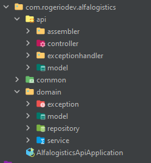
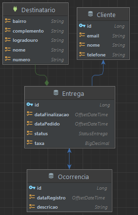

# Alfalogistics
## API de Rest controle de entregas.


## Apresentação:
https://youtu.be/28QG0io687U

## Colaboradores:
- José Rogério

## Executando esse projeto:

- Na Pasta Raiz do projeto execute:
```bash
./mvnw spring-boot:run
```

- Interaja com a API através do Postman importando a Collection:
https://www.getpostman.com/collections/5db4a0889ebb82dd972d
----
### Organização dos Pacotes


#### Diagrama de Relacionamentos do Banco de Dados


---
### Banco de Dados
- O Banco de Dados desse projeto é H2. Caso deseje alterar o banco altere as informações presentes no arquivo: /src/main/resources/application.properties


### Tecnologias Utilizadas
* Springboot
* Loobok
* Maven
* Jakarta Bean Validation
* Flyway
* ModelMapper
